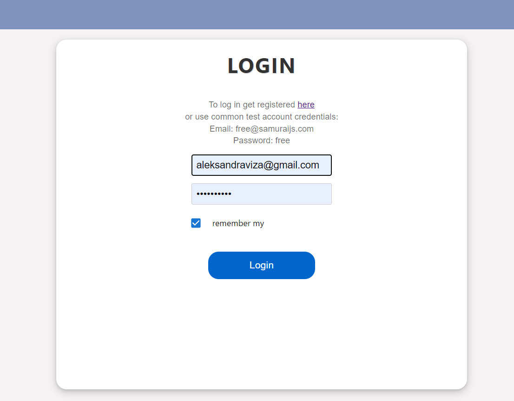
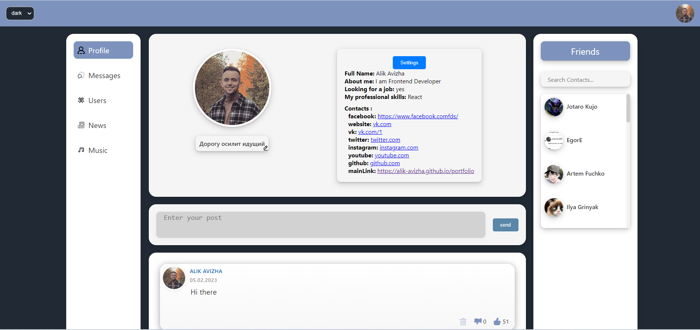
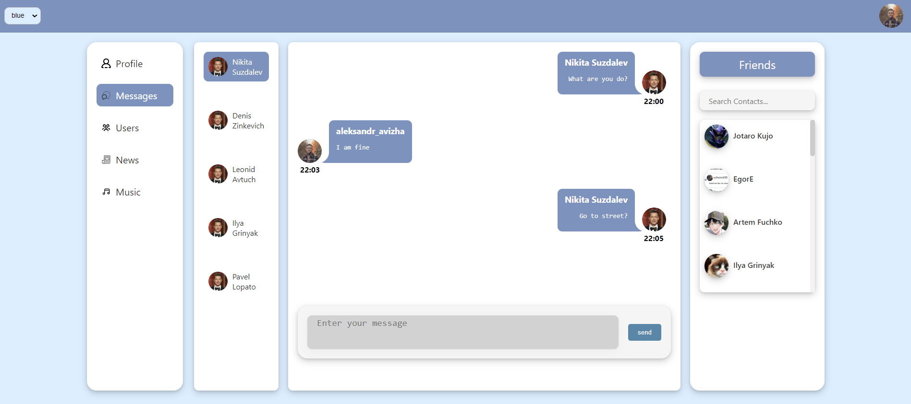
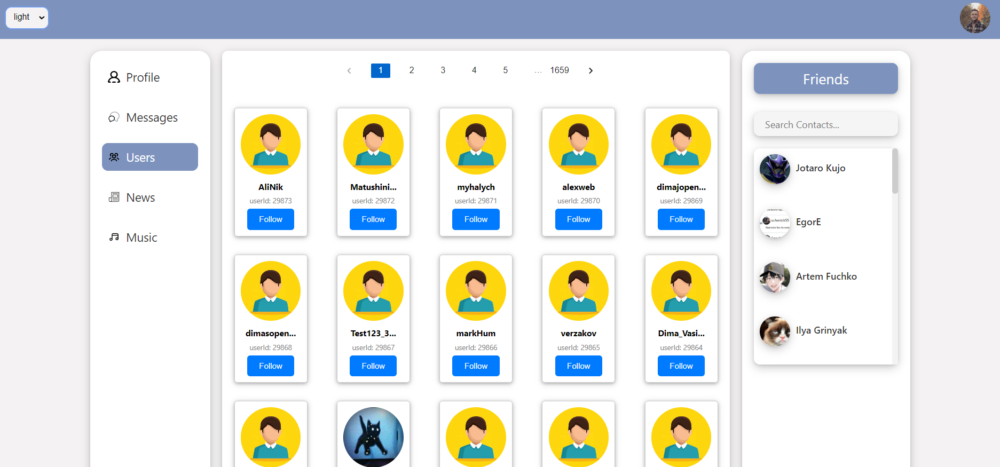

# Social-network

### The project is under development. Some features may be unavailable.

https://alik-avizha.github.io/my_social_network/

An online platform that is used for communication, dating, creating social relationships between people who have similar interests or offline connections

There are several sections in the social network, the first one is 'Profile'. Here you will see information about users,
and you can also change yours. There is also a feed of posts that the user can create.

More than 24,000 users have already registered on the social network. You can see their entire list in the "Users"
section. From there, you can go to their "Profile" and view their information.

The project is under development. Some features may be unavailable.
If you have questions or want to know something, you can write to [me](https://www.linkedin.com/in/aleksandr-avizha/).

---

### Technologies:

- React (class components)
- TypeScript
- Redux
- React-Redux
- React-Router-Dom
- Redux-Thunk
- Redux-Form
- Axios
- Material UI